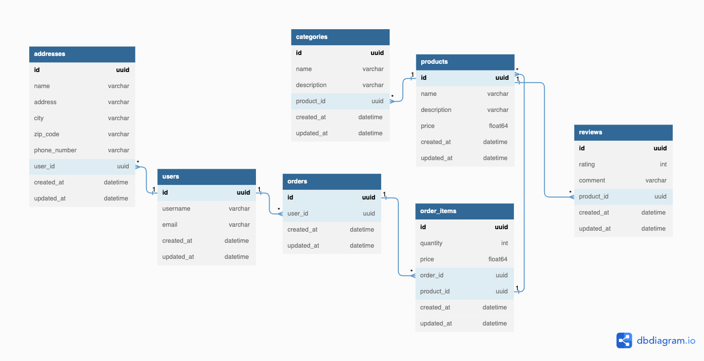

## Backend Implementation for an E-Commerce App
**Ahmet Eren BOYACI**

I developed a scalable backend for an e-commerce app to demonstrate my backend development skills.

- Docker & Docker-Compose
- PostgreSQL
- Golang (1.18)
  - Gin-Gonic
  - Gorm
  - Zap Logger
- Authentication & Authorization Implementation
- Repository and Singleton patterns
- Dependency Injection
- Gorm database hooks to validate data given

### Database Diagram

